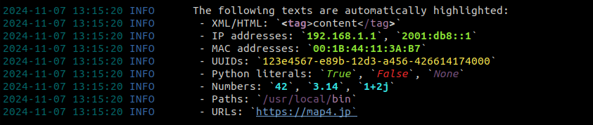

# Rich Logger

A powerful Python logging utility that combines structured logging with rich text formatting and automatic syntax highlighting. Built on top of `structlog` and `rich` libraries, this logger provides beautiful console output with customizable styling and intelligent highlighting.

## Features

- 🎨 Rich text formatting with markup tags
- 🔍 Automatic syntax highlighting for:
  - XML/HTML tags and attributes
  - IP addresses (IPv4, IPv6)
  - MAC addresses (EUI-48, EUI-64)
  - UUIDs
  - Function calls
  - Python literals (True, False, None)
  - Numbers (including complex numbers)
  - File paths
  - String literals
  - URLs
- 📊 Structured logging with customizable columns
- 🎯 Multiple log levels with color-coded output
- ⏰ Automatic timestamp formatting
- 🔑 Styled key-value pairs for context data

## Installation

```bash
pip install richlogger
```

## Usage

### Basic Usage

```python
from richlogger import Logger

# Initialize logger with default INFO level
logger = Logger()

# Basic logging
logger.info("Starting application")
logger.debug("Debug information")
logger.warning("Warning message")
logger.error("Error occurred")
logger.critical("Critical error!")
```

### Rich Text Markup

You can use markup tags to style your log messages:

```python
logger.info("Here are rich text markup examples:")
logger.debug(" - This is a debug message which most likely won't be seen")
logger.info(" - We are hiring. Visit our [link=https://map4.jp]website[/link]!")
logger.warning(" - :warning-emoji: We are going to have a problem")
logger.error(" - [bold red]ALERT![/bold red] Something happened")
logger.critical(" - :fire: :boom: :scream: :fire: :boom: :scream:")
```

](images/example-text-markup.png)

You can find available markup styles in the [rich docs](https://rich.readthedocs.io/en/stable/markup.html).

### Log Levels

The logger supports standard Python log levels:

- CRITICAL/FATAL
- ERROR
- WARNING/WARN
- INFO (Default)
- DEBUG
- NOTSET

Set the log level during initialization:

```python
logger = Logger(log_level="DEBUG")
# or
import logging
logger = Logger(log_level=logging.DEBUG)
```

### Structured Logging

Add context with key-value pairs:

```python
logger.info("User logged in", user_id="123", ip="192.168.1.1")
logger.error("Database connection failed",
             retry_count=3,
             database="users")
```

## Automatic Highlighting

The logger automatically highlights various patterns in your log messages:

- XML/HTML: `<tag>content</tag>`
- IP addresses: `192.168.1.1`, `2001:db8::1`
- MAC addresses: `00:1B:44:11:3A:B7`
- UUIDs: `123e4567-e89b-12d3-a456-426614174000`
- Python literals: `True`, `False`, `None`
- Numbers: `42`, `3.14`, `1+2j`
- Paths: `/usr/local/bin`
- URLs: `https://example.com`

```python
logger.info("The following texts are automatically highlighted:")
logger.info(" - XML/HTML: `<tag>content</tag>`")
logger.info(" - IP addresses: `192.168.1.1`, `2001:db8::1`")
logger.info(" - MAC addresses: `00:1B:44:11:3A:B7`")
logger.info(" - UUIDs: `123e4567-e89b-12d3-a456-426614174000`")
logger.info(" - Python literals: `True`, `False`, `None`")
logger.info(" - Numbers: `42`, `3.14`, `1+2j`")
logger.info(" - Paths: `/usr/local/bin`")
logger.info(" - URLs: `https://map4.jp`")
```

](images/example-auto-highlighting.png)

## Dependencies

- Python 3.8+
- `structlog`
- `rich`
